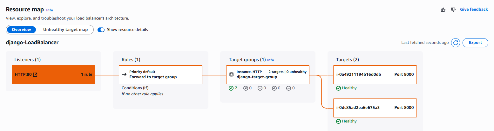
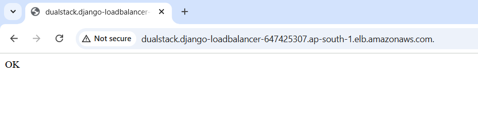

## ✧･ﾟ: ✧･ﾟ:  𝔻𝕖𝕡𝕝𝕠𝕪𝕚𝕟𝕘 𝕒 𝔻𝕛𝕒𝕟𝕘𝕠 𝔸𝕡𝕡𝕝𝕚𝕔𝕒𝕥𝕚𝕠𝕟 𝕠𝕟 𝔸𝕎𝕊 𝕌𝕤𝕚𝕟𝕘 𝕋𝕖𝕣𝕣𝕒𝕗𝕠𝕣𝕞, 𝕁𝕖𝕟𝕜𝕚𝕟𝕤, 𝕒𝕟𝕕 𝔾𝕚𝕥ℍ𝕦𝕓 𝔸𝕔𝕥𝕚𝕠𝕟𝕤   :･ﾟ✧:･ﾟ✧

In this project, we deploy a Django-based web application on AWS ECS (Elastic Container Service) using Terraform for Infrastructure as Code (IaC). The application is containerized with Docker, the image is stored in ECR (Elastic Container Registry), and the infrastructure is managed entirely through automated CI/CD using Jenkins and GitHub Actions. We also use S3 as the Terraform backend and RDS for the database layer.

#### **NOTE:**
##### This project is based on another project that you can find in this link: https://github.com/NotHarshhaa/DevOps-Projects/tree/master/DevOps-Project-04 But I upgraded it adding to it some other services, like: git actions, jenkins CI Pipeline, terraform, and S3 as a backend.

#### Diagram: End-to-End CI/CD Pipeline Workflow (GitHub → Jenkins → AWS):

## Step-by-Step Explanation of the CI/CD Pipeline
### GitHub Push Triggers CI
When a developer pushes code to the main branch, GitHub Actions automatically triggers the Jenkins job Deploy-Django-on-AWS via a webhook exposed by ngrok (since Jenkins runs locally in a Docker container).
#### **Because Jenkins ran on a docker container accessing it was through the URL: http://127.0.0.1:8080**  
#### **So I used Ngrok to connect GitHub Action to my jenkins:** 
#### **Running the command: 'ngrok http 8080', exposed my local Jenkins to GitHub Actions,**
#### **in this way github actions had the ability to trigger Jenkins start the pipeline**
#### **A Screen shot of the ngrok connection:** 

### Jenkins Pipeline Stages
#### Stage 1: Clean Workspace
Clears the Jenkins workspace to avoid conflicts or stale files from previous runs.
#### Stage 2: Clone Repository
Pulls the latest code from the GitHub repo (Deploy-Django-On-AWS) including:
* **Django/:** Django application code
* **infrastructure/:** Terraform code for network, subnets, ALB
* **ecs_cluster/:** Terraform code for ECS, RDS
* **ecr_repository/:** Terraform code for ECR
#### Stage 3: Check and Create S3 Bucket
* Checks if the django-terraform-state-files S3 bucket exists.
* If not, it creates the bucket using AWS CLI.
* Writes env.auto.tfvars with the bucket and region info.
#### Stage 4: Create or Check ECR Repository
* Runs terraform init in ecr_repository/, using the S3 bucket as the backend. 
**Executes terraform plan:** 
* If changes exist (exitCode == 2), runs terraform apply to create the ECR repo.
* _Result:_ An ECR repo is created to hold the Django Docker image.
#### Stage 5: Get Terraform Outputs
* Fetches output variables from ecr_repository (specifically the ECR repo URL).
* Sets it as an environment variable (ECR_REPO) for use in the next stages.
#### Stage 6: Create Django Docker Image
* Goes into the Django/ folder.
* Logs into ECR using AWS CLI.
* Builds the Docker image for the Django app.
* Tags and pushes the image to the ECR repository.
#### Stage 7: Infrastructure Creation (VPC, Subnets, ALB, etc.)
* Enters the infrastructure/ folder.
* Initializes Terraform using infra/terraform.tfstate as the S3 key.
* Runs terraform plan and applies the infrastructure if changes are detected.
* **_Resources created here include:_** 
* ##### VPC
* ##### Public/private subnets
* ##### Internet Gateway, NAT Gateway
* ##### ALB (Application Load Balancer)
* ##### Security Groups
#### Stage 8: Terraform Apply ECS (ECS + RDS)
* Enters ecs_cluster/ folder.
* Initializes Terraform with ecs/terraform.tfstate.
* Imports the ecsTaskExecutionRole (if it exists), otherwise it is created.
* Runs terraform plan and terraform apply if needed.
* Resources created here include:
* ECS Cluster with EC2 launch type
* ECS Task Definition (points to Docker image in ECR)
* ECS Service (uses ALB, listens on port 8000)
* EC2 instances as ECS workers
* RDS MySQL database
* IAM roles for ECS tasks and EC2 instances
* VPC endpoints for ECR
* Security groups to allow ECS↔RDS communication

_**NOTE:** EC2 Launch Type was used to give more control over networking, instance scaling, and to avoid additional Fargate costs._

#### The Infrastructure of the Project:

### Terraform State Storage in S3
#### By separating Terraform state files per module (ECR, infrastructure, ECS), each part of the system becomes independently manageable. This allows for modular deployment and minimizes blast radius on changes:
* ecr_repository/terraform.tfstate → Stored under ecr_folder/ in S3
* infrastructure/terraform.tfstate → Stored under infra/
* ecs_cluster/terraform.tfstate → Stored under ecs/
* This allows Terraform to track changes to each layer of the infrastructure independently.
### Post Actions
* The pipeline sends an email to my email address:
* The build result (SUCCESS, FAILURE, etc.)
* Jenkins console log (optional)
* This acts as a deployment confirmation and audit log.
#### An Example of the message that I recieved after the pipeline was done:

## Technologies Used
### Django
Django is a high-level Python web framework that promotes rapid development and clean design. It uses Python for backend logic and HTML/CSS/JS for frontend. In this project, Django serves as the core application we're deploying.  

#### The Flow of Data From the Internet to the private instance that has the service:

### Docker
Docker packages applications and their dependencies into isolated environments called containers. We build a Docker image for our Django app and use it across all environments, ensuring consistency.  
### Amazon ECR (Elastic Container Registry)
ECR is AWS’s fully managed container image registry. In our setup:  
* We push the Django Docker image to ECR.
* ECS tasks later pull this image to run containers.
### Amazon ECS (Elastic Container Service)
ECS allows us to run and scale containerized applications on AWS. In this project:
* We use the EC2 launch type (ECS runs containers on EC2 instances).
* The ECS service runs our Django app using the Docker image stored in ECR.

## A diagram that shows how ECS Cluster is created and functions, from the point of pulling image from ECR to the start of a service:

### Terraform
Terraform is used for Infrastructure as Code:
* Creates the VPC, subnets, EC2s, ECS cluster, security groups, RDS, etc.
* Stores Terraform state remotely in S3 to ensure consistency between pipeline runs.
Three Terraform folders:
* ecr_repository → Creates ECR
* infrastructure → Sets up VPC, subnets, ALB, etc.
* ecs_cluster → Launches ECS service, RDS, task definitions, and networking.
### Amazon S3 (Terraform Backend)
S3 stores Terraform state files:
* ecr_folder/terraform.tfstate
* infra/terraform.tfstate
* ecs/terraform.tfstate
This ensures Terraform can compare current infrastructure with previous state and only apply changes if needed.
### GitHub Actions
* GitHub Actions trigger the Jenkins pipeline automatically.
* A file walaa-action.yaml in .github/workflows runs on every push to the main branch (excluding .md files).
* It sends a trigger to Jenkins via a webhook to start the pipeline.
### Amazon RDS
* RDS (Relational Database Service) is used to host a managed MySQL database.
* ECS tasks connect to RDS to serve Django’s backend logic.
* Connection parameters (host, username, password) are passed securely via environment variables.

## The Result Of The Project In The Cloud:
### VPC-Virtual Private Cloud Map of the infrastructure (subnets,InternetGateway,RouteTable):

--------------------------------------------------------------------------------------------------------------------------------

### The DataBase in The RDS Configurations:

--------------------------------------------------------------------------------------------------------------------------------

### ECS Details and Metrics:
#### ECS output, shows that there are two tasks runnign in it each one in a private instance:

#### ECS Task Metrics:

--------------------------------------------------------------------------------------------------------------------------------

### S3 Bucket:
#### The Output of S3 Bucket after the pipeline finishes successfully:

#### S3 Bucket After the pipeline finishes running, there are three objects (ECR,Infrastructure and ECS), each has it's own terraform state file:

--------------------------------------------------------------------------------------------------------------------------------

### RDS:
#### An output of the S3 Bucket in AWS:

#### After the creation of the data base a subnet group is created:  
#### **A Subnet Group in AWS RDS (Relational Database Service) is a collection of subnets within a VPC (Virtual Private Cloud) that was designate for the project's RDS database instances to use.**
#### An Output of the subnet group is:

--------------------------------------------------------------------------------------------------------------------------------

### Load Balancer + Target Group:
#### The image shows details about the Target Group that was created and also shows that 'Healthy' status for both instances (targetS):

#### An output of the LoadBalancer Details and Resource map:

#### The Resource Map of the Load Balancer that shows the flow of the data from the ALB to the target group to the ECS instances:

--------------------------------------------------------------------------------------------------------------------------------

### The Output:
#### If you enter the DNS name in the internet Browser it will return the results of the Django that was created inside the docker files, which is 'OK':

### Sumary of what this project does:
* Automates end-to-end deployment of a Django app  
* Uses Terraform to provision all AWS resources  
* Stores Terraform state in S3 (per environment)  
* Uses Jenkins for CI/CD and GitHub Actions for automation  
* Deploys containerized Django app via ECS EC2  
* Connects ECS tasks securely to RDS database  